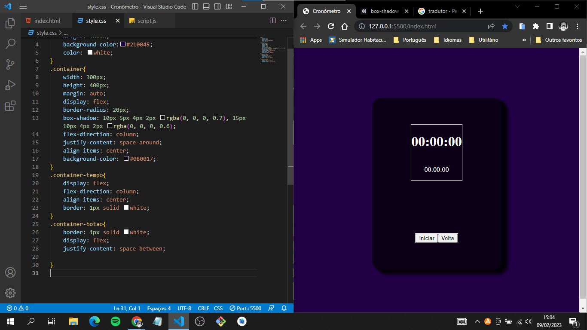

# CalculadoraSimples

Esse é um projeto para colocar em prática meus conhcimentos em Javascript da melhor forma.

## Índice

- [Visão geral](#visão-geral)
  - [O desafio](#o-desafio)
  - [Captura de tela](#captura-de-tela)
  - [Links](#links)
- [Meu processo](#meu-processo)
  - [Construído com](#construído-com)
  - [O que aprendi](#o-que-aprendi)
  - [Desenvolvimento contínuo](#desenvolvimento-contínuo)
- [Autor](#autor)
- [Agradecimentos](#acknowledgments)

## Visão geral

### O desafio

O usuário irá:

- Cronometrar um determinado tempo decorrido.
- Marcar o tempo de voltas.
- Parar o tempo.
- Retornar o tempo de onde parou.
- Restaurar o cronômetro em geral.

### Captura de tela

### Links

[Walter Nascimento](https://medium.com/walternascimentobarroso-pt/cron%C3%B4metro-em-js-9b440308090)

## Meu processo

### Construído com

- Marcação HTML5
- Propriedades personalizadas CSS
- Flexbox
- Javascript para efetuar as funcionalidades do cronômetro.

### O que eu aprendi

### Desenvolvimento contínuo

## Autor

- Website - [Hudney Brito](https://hudney-fsbrito.github.io/Hudney-Brito-Portfolio-/)

